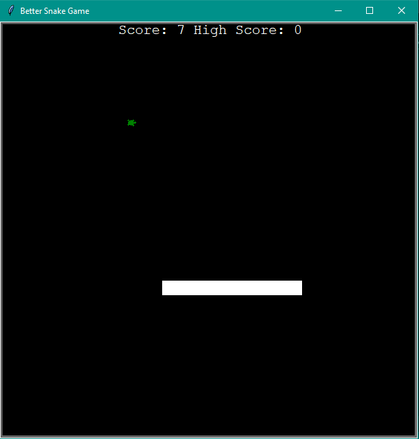
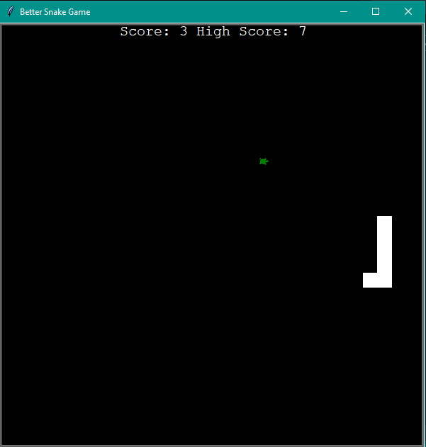

# Better Snake Game

Improved version of my previous [Snake Game](https://github.com/naboshi229/My_Basic_Programs/tree/main/Snake_Game). High Score is now saved in a file data.txt, when you open a game once again you have your previous high score shown.
## What you need to download:
- main.py (Only file that you need to open in order to play)
- snake.py
- food.py
- scoreboard.py
### Every file needs to be in the same dictionary!!! Otherwise my game will not work!!!

