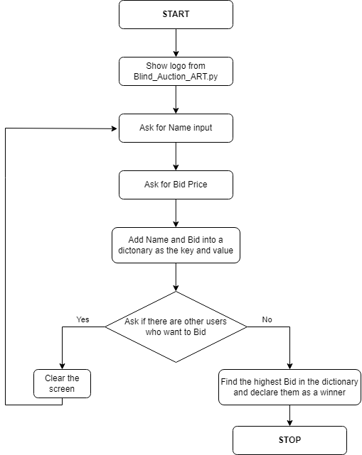

# Blind_Auction
## Description
This program imitates blind auction. Taking various names and bids in loop. Printing the winner of the auction with the highest bid at the end.
## Quick note
- Blind_Auction.py
- Blind_Auction_ART.py
### These are the files you need to download in order for my program to work properly.
## Flow Chart for this program

