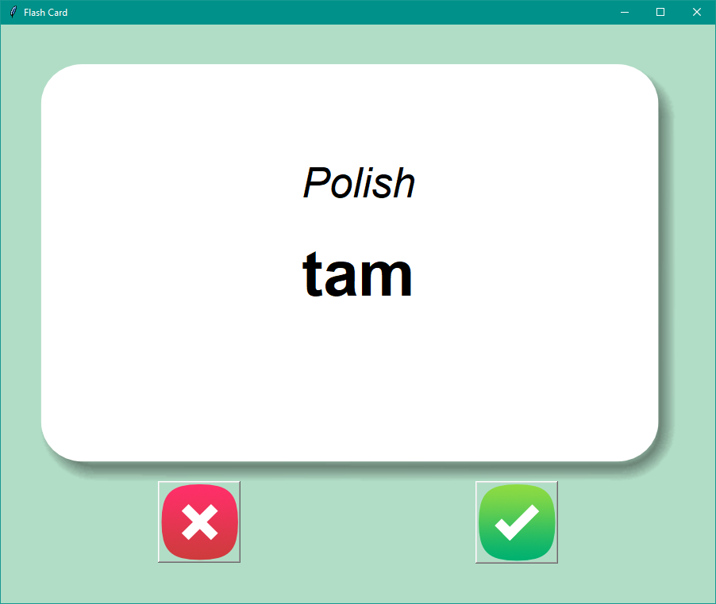
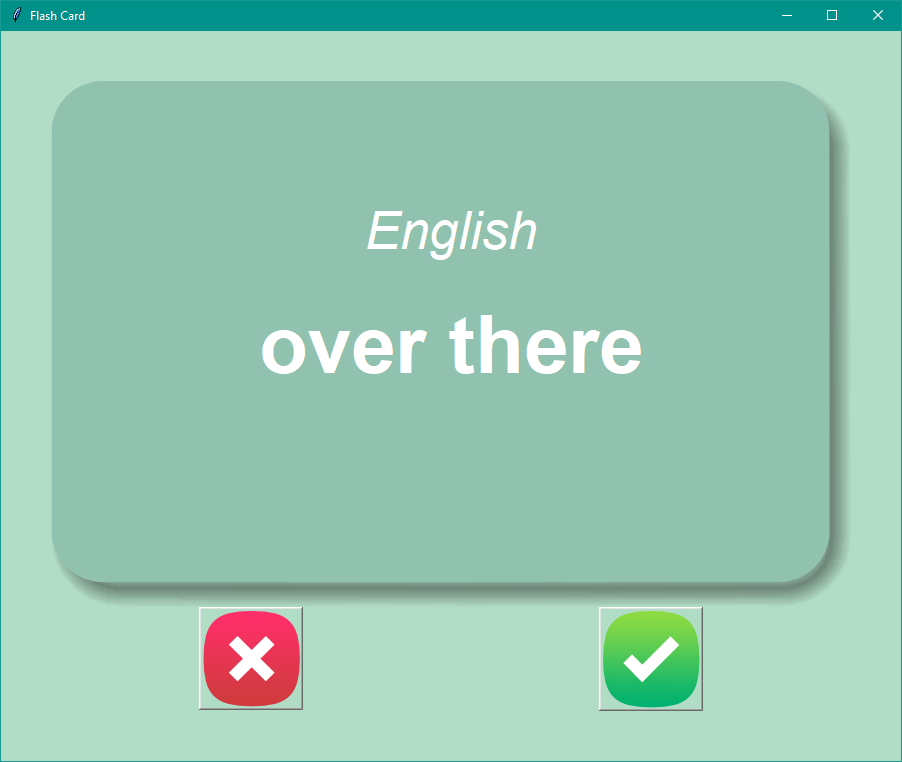
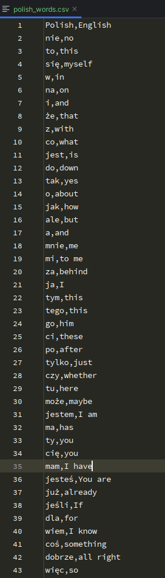
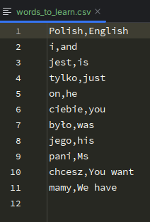

# Flash Card

Flash card application that was written fully in python. Firstly the front of the flash card appears containing a polish word, after 3 seconds the english equivalent will be shown (next screenshots). I used [pandas library](https://pandas.pydata.org/) to read an create a new .csv flie containing app's data.

Program firstly uses database "polish_words.csv" stored in data folder.

If user presses "✔" button shown, chosen randomly word will be removed from newly created dictionary, after pressing "❌" button that word will stay in a newly created dictionary. After closing a program a new database named "words_to_lean.csv" will be created in data folder, containing words that user marked as unknown (via "❌" button).

> [!WARNING]
> What you need to download:
>- main.py (Only file that needs to be open, in order to start that program)
>- data (folder)
>- images (folder)
