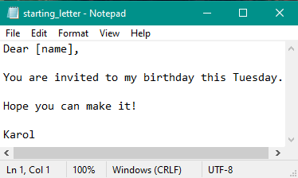
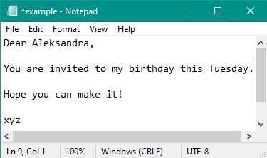

# Mail Merge

A simple program that takes names from "./Input/Names/invited_names.txt" and puts them into the list using readlines() module. Then program gets a starting letter from "./Input/Letters/starting_letter.txt". For loop then creates letters in "./Output/ReadyToSend/" replacing the placeholder "[name]" with the actual names stored invited_names.txt. Saving files with names "letter_for_{stripped_name}.txt".
## You need to download:
- main.py (Only file that you need to open in order to start program)
- Input (Folder with all of the content)
- Output (Folder with all of the content)
### | main.py , Input (Folder with content) , Output (Folder with content) | Needs to be in the same dictionary!!! Otherwise my program will not work!!!
