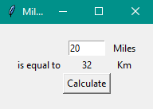

# Mile To Km Converter

A simple program that converts user's input from [miles](https://en.wikipedia.org/wiki/Mile#:~:text=The%20mile%2C%20sometimes%20the%20international,English%20feet%2C%20or%201%2C760%20yards.) to [kilometers](https://en.wikipedia.org/wiki/Kilometre). My first ever program in which I used [tkinter GUI](https://en.wikipedia.org/wiki/Tkinter) to make it more eye catching.
## What you need to download:
- main.py