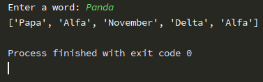
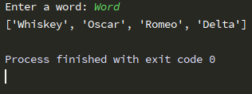

# NATO Alphabet Converter

Short program that changes the user's input (word) to [NATO Phonetic Alphabet](https://en.wikipedia.org/wiki/NATO_phonetic_alphabet). Program uses [pandas library](https://en.wikipedia.org/wiki/Pandas_(software)) to take and use value from 'nato_phonetic_alphabet.csv' file.

## What you need to download
- main.py
- nato_phonetic_alphabet.csv
### Every file needs to be in the same dictionary! Otherwise my program will not work.
