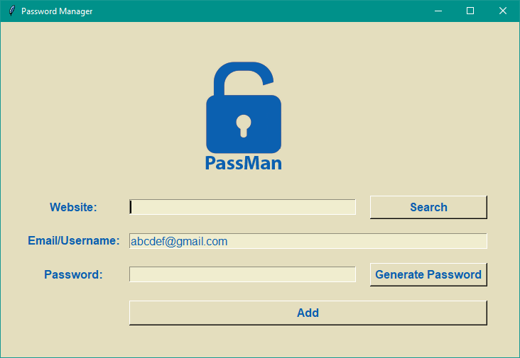
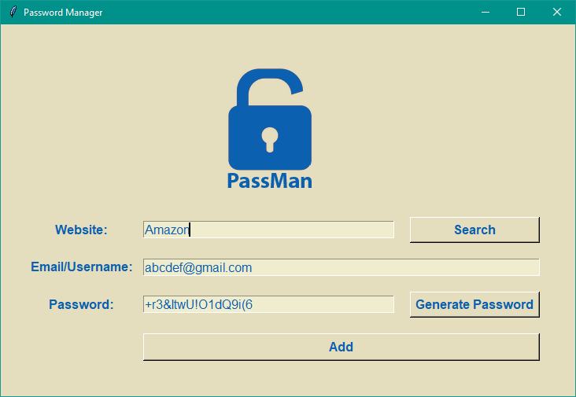
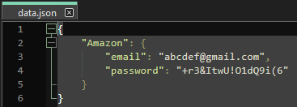

# Password Manager (PassMan)

-This is how program looks. "Generate" button will generate a random strong password.
-In website entry user can type the name of the website or paste website's login page link.
-E-mail has a default value of "abcdef@gmail.com", this can be change in my code marked with 🔴 EMAIL in the screenshot below.
-The value of EMAIL will be a defult value for "Email/Username" entry, even after restarting my program.

-If user left entries empty before hitting "Add" button, this message is going to pop-out, asking a user to not leave any empty fields.
-To leave the pop-out window just click "Ok" at the bottom right corner.

*When user succesfully fill all of the empty entries and hit "Add" Button, the window will pop-out with the title of the website name / link.
Showing user's entries and asking if it is ok to save them.
Generated password will be copied to the clipboard, user can paste it by hitting "CTRL+V" (paste shortcut).
I used [pyperclip](https://pypi.org/project/pyperclip/) for that.

User's entries will be saved in a data.txt file, using always the same format as in the screenshot above.

> [!What you need to download:]
- main.py (Only file that needs to be open, in order to start my program)
- logo.png (Just a logo with a catching name for my program)
