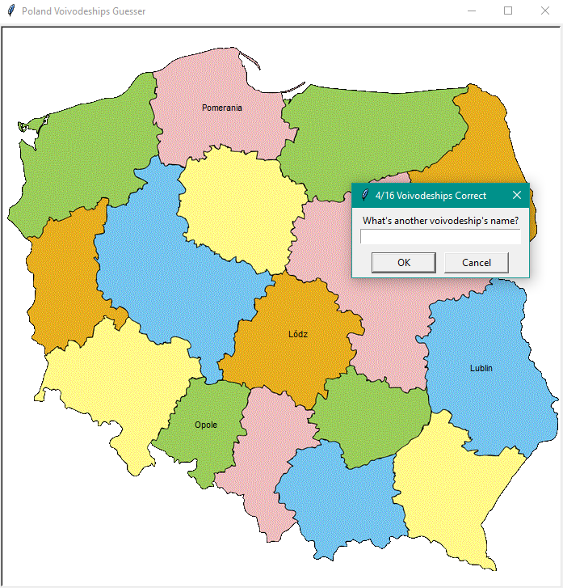
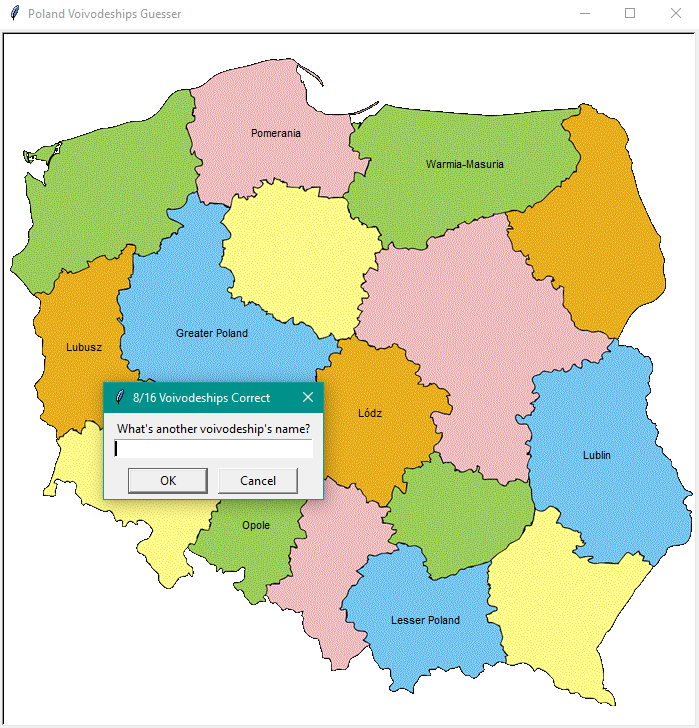

# Poland Voivodeships Guesser
Game in which player needs to guess all of the 16 Poland's Voivodeships. Every name of [Voivodeship is in english](https://en.wikipedia.org/wiki/Administrative_divisions_of_Poland#Voivodeships). If user doesn't manage to guess all of the Voivodeships, they can always type "Exit" to exit program, they will get a file "voivodeships_to_learn.csv" with all of the missing Voivodeships names. 
## What you need to download?
- main.py (the only file that user needs to open in order to start a game)
- 16_voivodeship.csv
- voivodeships_Poland.gif
### Every of the mentioned file above has to be in the same dictionary!!! Otherwise my program will not work!!!

