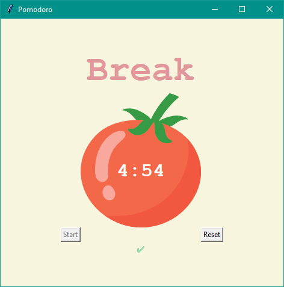
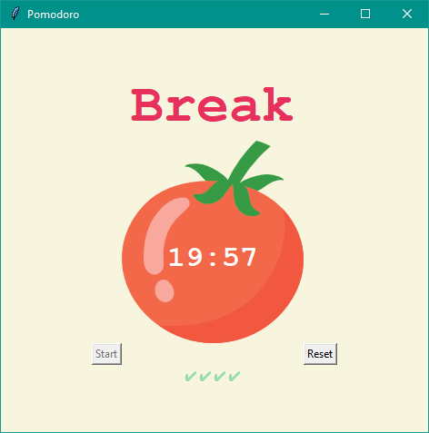

# Pomodoro

A timer which is based on [Pomodoro Technique](https://en.wikipedia.org/wiki/Pomodoro_Technique). After hitting start button program will be counting 'work time' which is set to 25 minutes. After that time timer will be counting 'short break time' which is set to 5 minutes and will add a small '✔' in the bottom. After completing 4 cycles (in other words getting those 4 '✔' in the bottom) program will be counting down the 'long break time' which is set to 20 minutes. There is also a reset button (that obviously resets my program and stops counting down) which only works when user has pressed the start button. Start button doesn't work when user has pressed start beforehand, to prevent overlaping the reps value in code. This prevents my program from bugs which weren't pleasant to look at.

## What you need to download:
- main.py (Ony file that you need to run in order to start my program)
- tomato.png (Just to display tomato image in my program)
