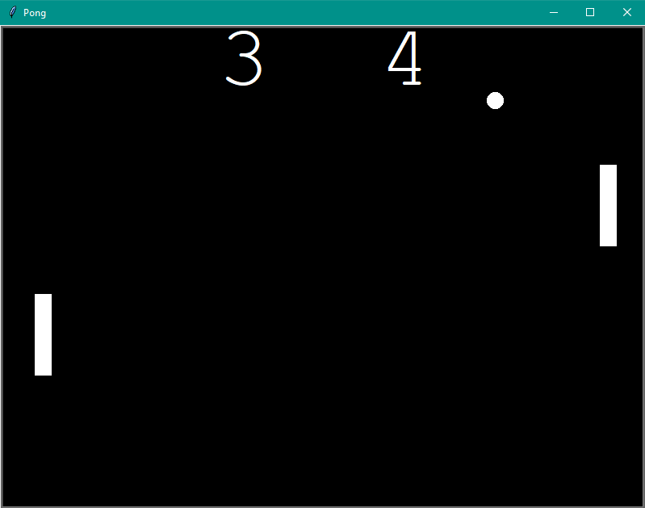

# Pong
## Description
[Classic Pong Game](https://en.wikipedia.org/wiki/Pong) that was written in python. [OOP](https://en.wikipedia.org/wiki/Object-oriented_programming) was used by me to make my program less clutterd and easy to read. Player on the left (left paddle) has to use "w" and "s" keys in order to move, player who uses right paddle moves by pressing "Up" and "Down" arrow keys. Ball is changing its speed after succesful bounce from the (right or left) paddle.
## Fixable errors
Both players can't press buttons at the same time. Will be fixed in the future! ;)
## What you need to download?
- main.py (The only file that you need to open in order to play pong)
- ball.py
- paddle.py
- scoreboard.py
##<code style='color: red'> Every mentioned file above needs to be in the same dictionary!!! Otherwise my program/game will not work!!!</code>

