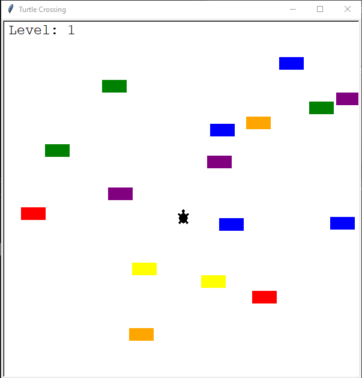
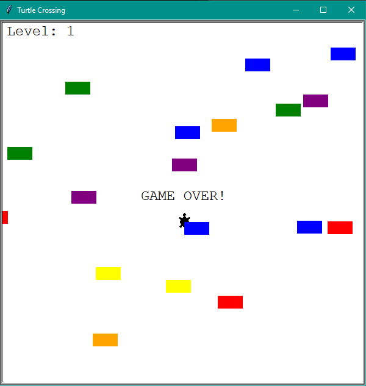

# Turtle_Crossing
## Description
This game was inspired by [Crossy Road](https://en.wikipedia.org/wiki/Crossy_Road) which was written fully in python language. I used [OOP](https://en.wikipedia.org/wiki/Object-oriented_programming) to make code more clear. Player can only move up by pressing "Up" arrow key. Cars are randomly generated. After successful cross the speed of cars increase and player moves to another level which is shown on top right corner. Game end when player "hits a car".
## What you need to get in order for my game to work?
- main.py (Only file that you need to open to start the game)
- player.py
- car_manager.py
- scoreboard.py
### Every of the mentioned files above needs to be in the same dictionary (folder)!!! Otherwise my game will not work!!!

